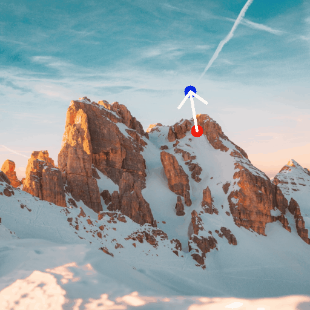
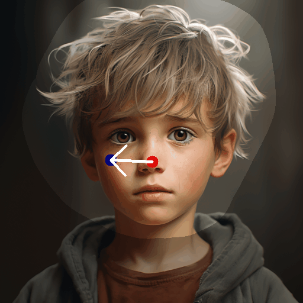
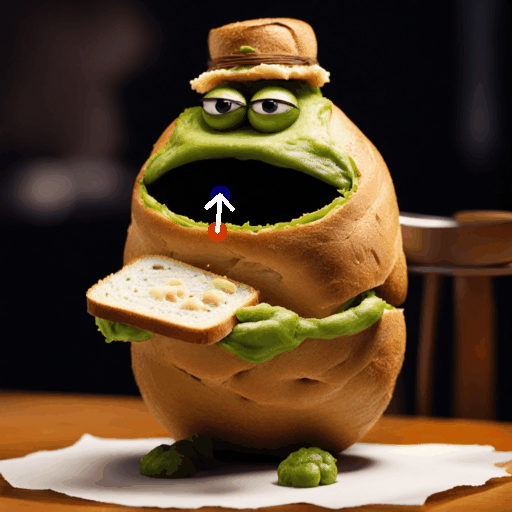
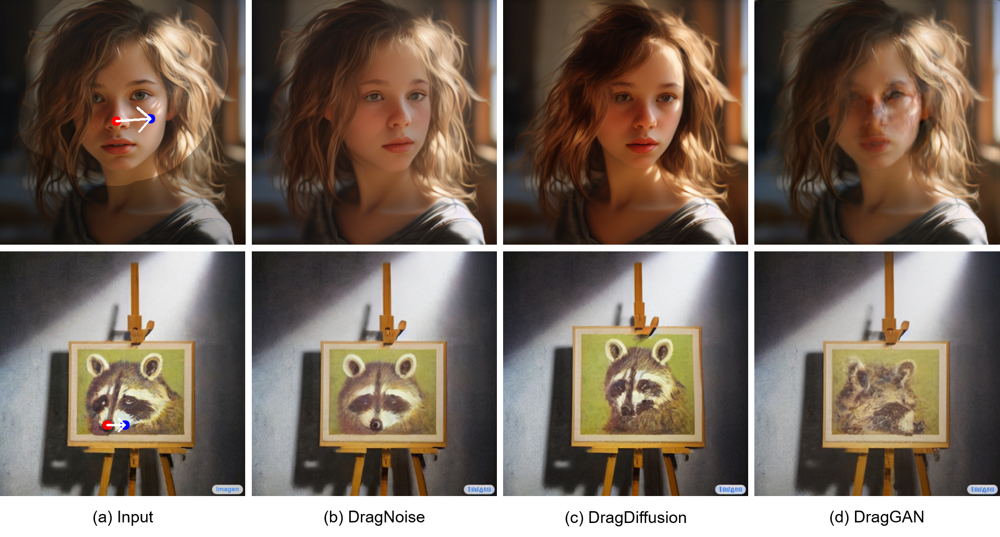
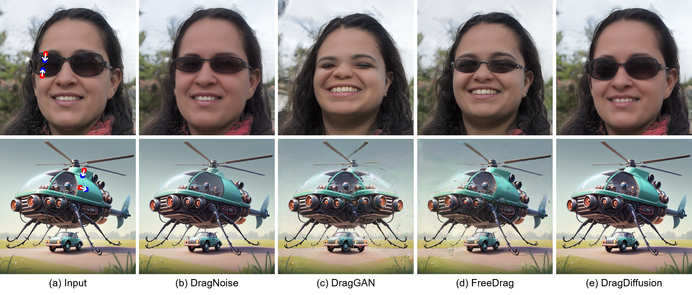

<p align="center">
  <h1 align="center">Drag Your Noise: Interactive Point-based Editing via Diffusion Semantic Propagation</h1>
  <p align="center">
    <strong>Haofeng Liu</strong>
    &nbsp;&nbsp;
    <strong>Chenshu Xu</strong>
    &nbsp;&nbsp;
    <strong>Yifei Yang</strong>
    &nbsp;&nbsp;
    <strong>Lihua Zeng</strong>
    &nbsp;&nbsp;
    <a href="http://www.shengfenghe.com/"><strong>Shengfeng He</strong></a>
  </p>
  <p align="center">
    <a href="https://arxiv.org/abs/2404.01050"></a>
    <a href="https://www.youtube.com/watch?v=gKq0s_CvCAg&t=1s"></a>
    <a href="https://space.bilibili.com/386002941?spm_id_from=333.1007.0.0"></a>
  </p>
  <div align="center">
    
    
    
    
    <p align="left">&emsp;&emsp;&emsp;&emsp;&emsp;DragNoise&emsp;&emsp;&emsp;&emsp;&emsp;&emsp;&emsp;DragDiffusion&emsp;&emsp;&emsp;&emsp;&emsp;&emsp;&emsp;DragNoise&emsp;&emsp;&emsp;&emsp;&emsp;&emsp;&emsp;DragDiffusion</p>
  </div>
  <div align="center">
    
    
    
    
    <p align="left">&emsp;&emsp;&emsp;&emsp;&emsp;DragNoise&emsp;&emsp;&emsp;&emsp;&emsp;&emsp;&emsp;DragDiffusion&emsp;&emsp;&emsp;&emsp;&emsp;&emsp;&emsp;DragNoise&emsp;&emsp;&emsp;&emsp;&emsp;&emsp;&emsp;DragDiffusion</p>
  </div>
  <div align="center">
    
    
    
    
    <p align="left">&emsp;&emsp;&emsp;&emsp;&emsp;DragNoise&emsp;&emsp;&emsp;&emsp;&emsp;&emsp;&emsp;DragDiffusion&emsp;&emsp;&emsp;&emsp;&emsp;&emsp;&emsp;DragNoise&emsp;&emsp;&emsp;&emsp;&emsp;&emsp;&emsp;DragDiffusion</p>
  </div>
  <div align="center">
    
    
    
    
    <p align="left">&emsp;&emsp;&emsp;&emsp;&emsp;DragNoise&emsp;&emsp;&emsp;&emsp;&emsp;&emsp;&emsp;DragNoise&emsp;&emsp;&emsp;&emsp;&emsp;&emsp;&emsp;&emsp;DragNoise&emsp;&emsp;&emsp;&emsp;&emsp;&emsp;&emsp;DragNoise</p>
  </div>
</p>

## News and Update
* [Apr 5th] v1.0.0 Release.

## Installation

It is recommended to run our code on a Nvidia GPU with a linux system. Currently, it requires around 14 GB GPU memory to run our method.

To install the required libraries, simply run the following command:
```
conda env create -f environment.yaml
conda activate dragnoise
```

## Run DragNoise
To start with, in command line, run the following to start the gradio user interface:
```
python3 drag_ui.py
```
Basically, it consists of the following steps:

### Dragging Input Real Images
#### 1) train a LoRA
* Drop our input image into the left-most box.
* Input a prompt describing the image in the "prompt" field
* Click the "Train LoRA" button to train a LoRA given the input image

#### 2) do "drag" editing
* Draw a mask in the left-most box to specify the editable areas. (optional)
* Click handle and target points in the middle box. Also, you may reset all points by clicking "Undo point".
* Click the "Run" button to run our algorithm. Edited results will be displayed in the right-most box.


## More result
<a id="more reault">
<div align="center">
    
    
    
    
    
  </div>
</a>

## License
Code related to the Drag algorithm is under Apache 2.0 license.


## BibTeX
If you find our repo helpful, please consider leaving a star or cite our paper :
```bibtex
@misc{liu2024drag,
      title={Drag Your Noise: Interactive Point-based Editing via Diffusion Semantic Propagation}, 
      author={Haofeng Liu and Chenshu Xu and Yifei Yang and Lihua Zeng and Shengfeng He},
      year={2024},
      eprint={2404.01050},
      archivePrefix={arXiv},
      primaryClass={cs.CV}
}
```

## Contact
For any questions on this project, please contact liuhaofeng2022@163.com

## Acknowledgement
This work is inspired by the amazing [DragGAN](https://vcai.mpi-inf.mpg.de/projects/DragGAN/). We also benefit from the codebase of [DragDiffusion](https://github.com/Yujun-Shi/DragDiffusion). 
## Related Links
* [Drag Your GAN: Interactive Point-based Manipulation on the Generative Image Manifold](https://vcai.mpi-inf.mpg.de/projects/DragGAN/)
* [DragDiffusion: Harnessing Diffusion Models for Interactive Point-based Image Editing](https://github.com/Yujun-Shi/DragDiffusion)
* [DragonDiffusion: Enabling Drag-style Manipulation on Diffusion Models](https://mc-e.github.io/project/DragonDiffusion/)
* [FreeDrag: Point Tracking is Not You Need for Interactive Point-based Image Editing](https://lin-chen.site/projects/freedrag/)


## Common Issues and Solutions
1) For users struggling in loading models from huggingface due to internet constraint, please 1) follow this [links](https://zhuanlan.zhihu.com/p/475260268) and download the model into the directory "local\_pretrained\_models"; 2) Run "drag\_ui.py" and select the directory to your pretrained model in "Algorithm Parameters -> Base Model Config -> Diffusion Model Path".


